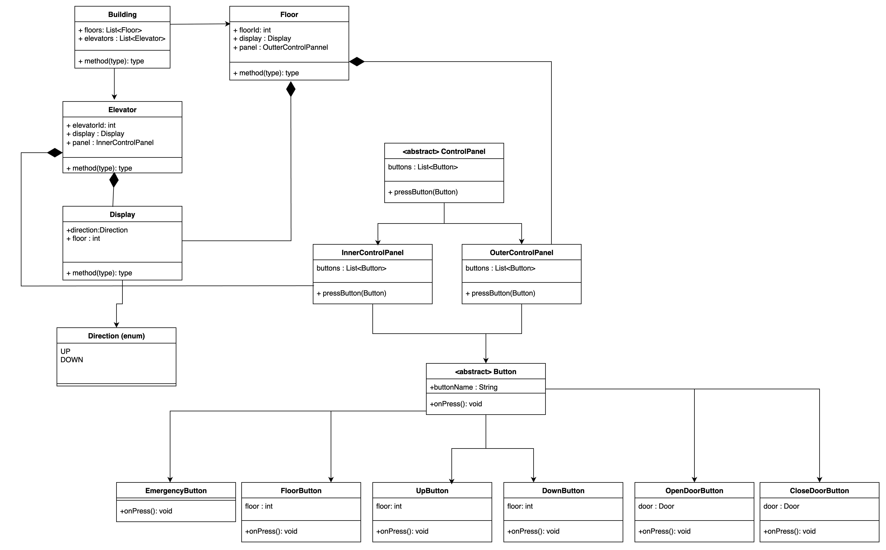

Design an Elevator with the following bare minimum functionalities

1.  The system shall include N elevator cars. The elevators will service a building that has up to M floors. 

2.  The elevator can go up and down, or remain idle in a real-world fashion.

3.  When elevator is going up or down, it will stop at all the floors that the users requested.

4.  Outside Control Panel - An external panel with up and down buttons shall be available on each floor to call an elevator. 

5.  Inside Control Panel - Inside each elevator, a control panel with buttons for all floors and door operation (open/close) shall be provided.

6.  Displays: Each elevator shall have internal and external displays. Both displays shall indicate the current floor and the direction of movement.

